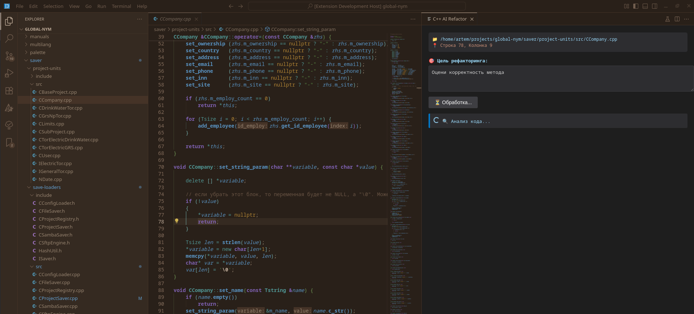
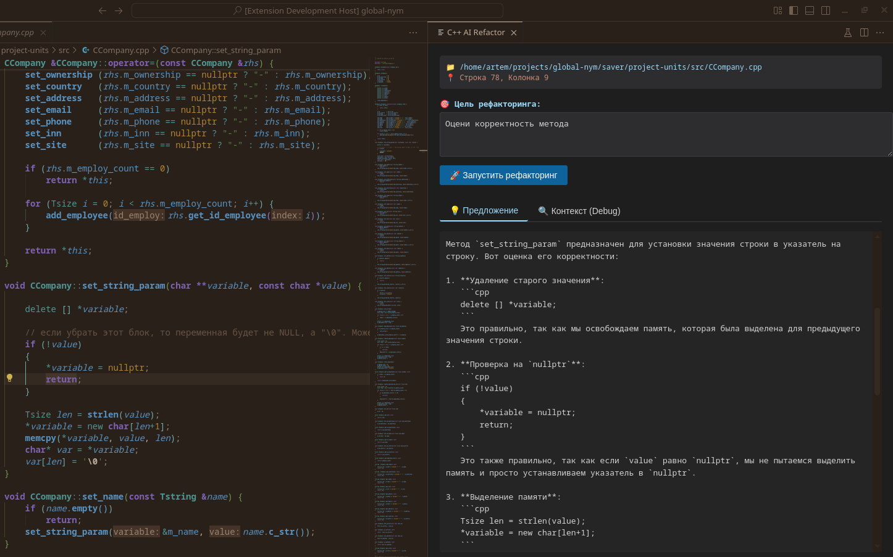
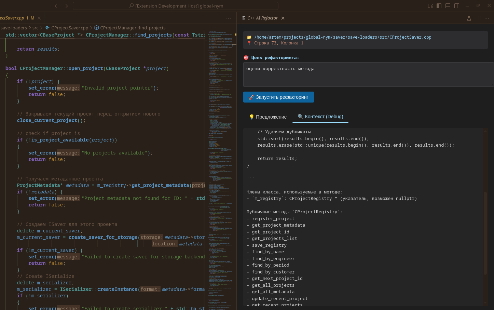

# 🔧 C++ AI Refactor для VS Code / code-oss на FreeBSD

> 🤖 Плагин для интеллектуального рефакторинга C++ кода с использованием локального LLM (llama.cpp) и libclang. 
`Opensource` AI-агент **`Continue`** на `FreeBSD` не хочет работать, пришлось приобщаться к AI-агентам самостоятельно. Пока реализована только интеграция AI в IDE `Code-OSS` без многих фич, но уже реализовано:

- виден отправляемый в `AI` контекст (для дебага)
- есть задание для `AI-агента`
- по нахождению курсора определяется обрабатываемый метод (не испытавал когда курсор ВНЕ метода)
- Собственно сам AI не молчит. 

@detail можно даже не рафакторить а обсуждать вопросы с AI - нужно сохранять контекст, править промпты и реализовать многоразовое обращение к AI в рамках одного вопроса (плагин->AI ), 

но мысль интересна.


Вепереди:
>
- улучшение интерфейса плагина для динамического изменения координат курсора
- курсор в хидер-файле с любым (в рамках разумного) запросом `AI-агенту`
- поддержка `C`-кода

---

## ✨ Особенности

- 🔍 **Точный анализ кода** — через libclang (определение методов, классов, членов, типов) (ну как точный... старался)
- 🏠 **Полная приватность** — локальный AI через llama.cpp сервер (не требует интернета)
- 🧠 **Контекстно-зависимые предложения** — в LLM передаётся:
  - Код метода
  - Используемые члены класса
  - Публичные методы зависимых типов
- ⚡ **Автоматическое применение изменений** — замена тела метода с сохранением форматирования и отступов (не тестировалось)
- 🖥️ **Интерактивный Webview** — вкладки "Предложение" и "Контекст (Debug)"
- 🐧 **Поддержка FreeBSD** — clang++, libclang, libcurl "из коробки"

---

## 🏗 Архитектура


| **VSCode Extension** | TypeScript, VS Code API | Регистрация команд, управление Webview, spawn процесса analyzer, применение изменений |
| **C++ Analyzer (CLI)** | C++17, libclang, libcurl | Парсинг кода, извлечение метода по позиции курсора, сбор контекста, HTTP запрос к LLM |
| **llama.cpp сервер** | C++, HTTP | Локальный сервер на порту 8080, endpoint `/completion` |

### Диаграмма потока данных
```text
    📁 C++ файл
         │
         ▼
    🖱️ Пользователь (Ctrl+Alt+R)
         │
         ▼
    📦 VSCode Extension → spawn → 🔧 C++ Analyzer
         │                              │
         │                              ▼ libclang
         │                         🔍 Парсинг метода
         │                              │
         │                              ▼
         │                         📊 Сбор контекста
         │                              │
         │                              ▼ HTTP
         │                         🧠 llama.cpp:8080
         │                              │
         │                              ▼
         │                         💡 JSON с предложением
         │                              │
         ▼                              │
    🖥️ Webview (показ) ◄────────────────┘
         │
         ▼
    ✏️ Применить изменения → редактор
```
---

## 💻 Системные требования (хост разработки)

| Требование | Версия / Команда |
|------------|------------------|
| ОС | FreeBSD 13+ |
| Редактор | code-oss (VS Code) |
| LLM сервер | llama.cpp на `http://127.0.0.1:8080` |
| Компилятор | clang++19 |
| LLVM | llvm19 (libclang) |
| HTTP клиент | libcurl |
| Сборка | cmake |
| JS рантайм | node, npm |

### Установка зависимостей на FreeBSD
```
    pkg install llvm19 libcurl cmake npm node
```
---

## 📦 Установка расширения

### 1️⃣ Сборка C++ анализатора
```
    cd cpp-ai-refactor/cpp-tool
    mkdir build && cd build
    cmake .. -DCMAKE_C_COMPILER=clang19 -DCMAKE_CXX_COMPILER=clang++19
    make
```

### 2️⃣ Сборка TypeScript расширения
```
    cd ../..
    npm install
    npm run compile
```

### 3️⃣ Запуск в VS Code

- Открыть корневую папку с эти плагином в терминале и ввсести `$code-oss .`
- В открывшемся окне `code-oss` нажать `F5` для запуска `code-oss` с этим плагином
- открыть любую папку с проектом и после `<ctrl>+<shift>+<p>` набрать `AI Refactor:Analyze Current Method` и появится окно с поялми для ввода


>
- Или упаковать: `vsce package` → установить `.vsix`

---

## 🧠 Запуск llama.cpp сервера
```
    llama-server -m /path/to/model.gguf --host 127.0.0.1 --port 8080
```
**Испытуемые модели:**  
- `Qwen2.5-Coder-7B-Instruct-Q4_K_M.gguf`
- `CodeLlama-7B-Instruct-Q4_K_M.gguf`
- `DeepSeek-Coder-V2-Lite-Instruct-Q4_K_M.gguf`

---

## 🎯 Использование

1. 📁 Откройте C++ файл (`.cpp`, `.h`, `.hpp`, `.cc`, `.cxx`)
2. 🖱️ Установите курсор **внутрь** метода
3. ⌨️ Нажмите `Ctrl+Alt+R` или выполните команду `AI Refactor: Analyze Current Method`
4. 📝 В появившейся панели справа укажите цель рефакторинга, например:
   - `"Добавить проверки на nullptr и обработку ошибок"`
   - `"Добавить RAII и умные указатели"`
   - `"Оптимизировать циклы и уменьшить копирование"`
   - `"Добавить логирование входных параметров"`
5. 🚀 Нажмите **"Запустить рефакторинг"**
6. 💡 Просмотрите предложение AI во вкладке "Предложение"
7. ✏️ Нажмите **"Применить изменения"** — тело метода заменится автоматически





---

## 📂 Структура проекта
```
    cpp-ai-refactor/
    │
    ├── 📁 cpp-tool/                 # C++ анализатор (CLI)
    │   ├── 📄 analyzer.cpp          # Точка входа, сбор контекста
    │   ├── 📄 CMakeLists.txt        # Сборка под FreeBSD
    │   ├── 📁 include/
    │   │   ├── 📄 JsonUtils.h       # Экранирование JSON
    │   │   ├── 📄 LlamaClient.h     # HTTP клиент для llama.cpp
    │   │   ├── 📄 Parser.h          # Обёртка над libclang
    │   │   └── 📄 Types.h           # Структуры (MethodInfo, ClassInfo)
    │   └── 📁 src/
    │       ├── 📄 JsonUtils.cpp
    │       ├── 📄 LlamaClient.cpp   # libcurl + JSON парсинг
    │       └── 📄 Parser.cpp        # libclang: поиск метода по координатам
    │
    ├── 📁 src/                      # VSCode расширение (TypeScript)
    │   ├── 📄 extension.ts          # Регистрация команд, spawn процесса
    │   └── 📄 webviewView.ts        # UI панель (Webview)
    │
    ├── 📄 package.json              # Манифест расширения
    ├── 📄 tsconfig.json             # Настройки TypeScript
    │
    └── 📁 resources/
        └── 🖼️ icon.svg              # Иконка расширения
```
---

## 🔧 Конфигурация

### Изменение порта llama.cpp (по умолчанию 8080)

В файле `cpp-tool/src/LlamaClient.cpp`:
```c++
    curl_easy_setopt(curl, CURLOPT_URL, "http://127.0.0.1:8080/completion");
```
### Настройка параметров генерации

Там же:
```c++
    std::string json = "{\"prompt\": \"" + escaped + "\", \"n_predict\": 4000, \"temperature\": 0.2, \"stop\": []}";
```
| Параметр | Значение | Описание |
|----------|----------|----------|
| `n_predict` | 4000 | Максимальное количество токенов в ответе |
| `temperature` | 0.2 | Степень случайности (0 = детерминированно, 1 = креативно) |
| `stop` | [] | Стоп-слова (например, `["##", "---"]`) |

### Изменение цели рефакторинга по умолчанию

В `extension.ts` в HTML шаблоне:
```html
    <textarea id="goal" rows="3">Добавить проверки на nullptr и обработку ошибок</textarea>
```
---

## 🐛 Устранение неполадок

| Проблема | Решение |
|----------|---------|
| ❌ `curl init failed` | Установите libcurl: `pkg install libcurl` |
| ❌ `Cannot parse JSON response` | Проверьте, запущен ли llama.cpp сервер: `curl http://127.0.0.1:8080/completion` |
| ❌ `Method not found` | libclang не распарсил файл. Проверьте include пути в `Parser.cpp` → `extractIncludePaths()` |
| ❌ Пустой ответ от AI | Уменьшите `n_predict` или проверьте модель (нужна кодовая модель) |
| ❌ Зацикленный ответ от AI | Настройка промпта (в целом промпт должен быть динамическим, но пока в процессе тюнинга) |
| ❌ `clang_Cursor_getNumArguments` undefined | Убедитесь, что используется llvm19, а не старая версия |
| ❌ Ошибка линковки при сборке | Проверьте `CMakeLists.txt`: пути к `/usr/local/llvm19/lib` и `-lclang` |
| ❌ Не применяются изменения | Убедитесь, что координаты `body_start_line/col` корректны (проверьте вывод JSON) |

### Отладка

Для просмотра JSON, который возвращает analyzer, запустите вручную:
```
    ./cpp-tool/build/analyzer /path/to/file.cpp 42 10 "Добавить проверки"
```
---

## 📄 Лицензия

MIT — свободно для использования, модификации и распространения.

---

## 🙏 Благодарности и уважение

- [llama.cpp](https://github.com/ggerganov/llama.cpp) — локальный inference LLM
- [libclang](https://clang.llvm.org/doxygen/group__CINDEX.html) — парсинг C++ кода
- [VS Code API](https://code.visualstudio.com/api) — расширяемость редактора

---

## 📞 Поддержка

Для FreeBSD специфичных вопросов проверьте:
- Порт `llvm19` в коллекции портов
- Настройка `LD_LIBRARY_PATH` для libclang.so
