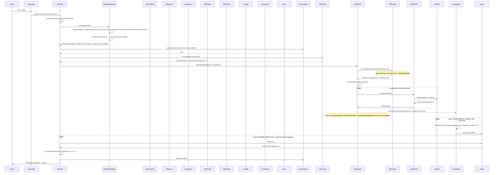
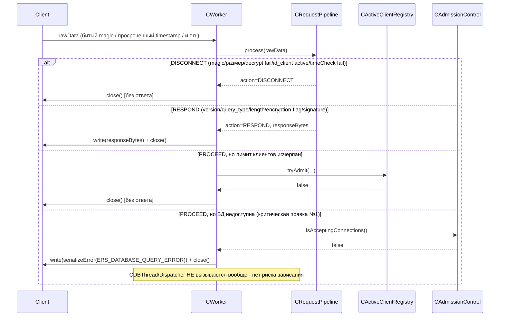
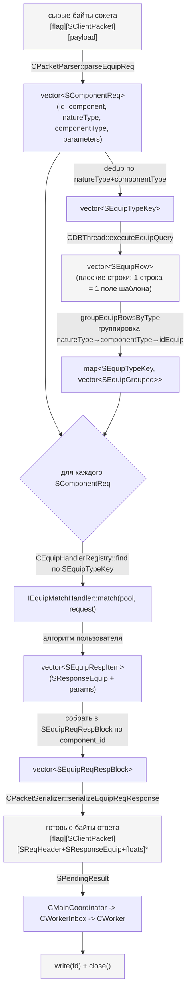
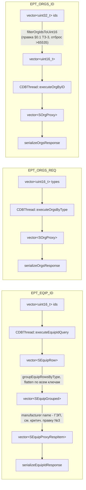
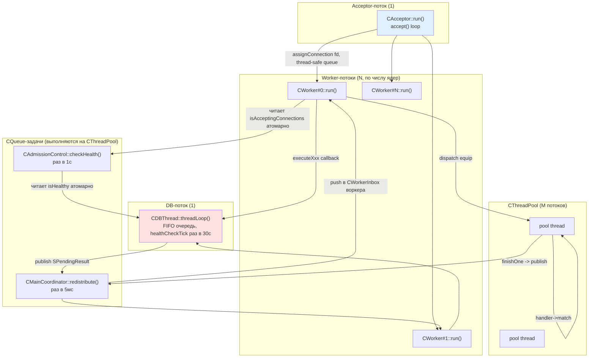

# Workflow / Dataflow — ServerD

Дополняет `architecture.mdj` (StarUML). Sequence-диаграммы StarUML вручную в JSON надёжно не собрать (хрупкая схема view/interaction) — поэтому здесь Mermaid: это тоже нотация UML sequence/activity, рендерится сразу, при желании воссоздаётся в StarUML вручную по этой же схеме.

Как открыть `architecture.mdj`: File → Open Project в StarUML. Диаграмм внутри нет намеренно (не рискнул битой геометрией view) — весь класс/пакет/связи уже в Model Explorer; чтобы получить визуальный Class Diagram, ПКМ на пакете (`Group1_Infrastructure` и т.д.) → Add Diagram → Class Diagram → перетащить нужные классы из Model Explorer на холст → ПКМ на холсте → Layout Diagram (автоматическая расстановка).

---

## 1. Workflow — полный цикл запроса `EPT_EQUIP_REQ`

### Ветки отказа (тот же вход, другой путь)

---

## 2. Dataflow — трансформация данных `EPT_EQUIP_REQ` (запрос → ответ)

### Dataflow — прямые запросы (без диспетчера подбора)

---

## 3. Карта потоков (thread map) — для дебага гонок

Единственные объекты с состоянием, к которым обращаются **несколько** потоков одновременно (точки, где искать гонки при дебаге): `CActiveClientRegistry` (мьютекс), `CTimeCheckRegistry` (мьютекс), `CWorkerInbox` (мьютекс, на воркер), `CMainCoordinator::m_results` (мьютекс), `CDBThread::m_queue` (мьютекс), `CThreadPool` internal queue (мьютекс), плюс три atomic-флага без мьютекса: `CDBThread::m_healthy`, `CAdmissionControl::m_dbHealthy`, `CWorker::m_nextRequestId`.
